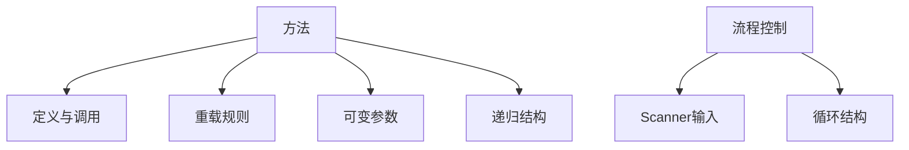

# Day 2: Java方法与流程控制

## 📌 知识图谱


---

## 🧩 代码实验室

### 核心练习

#### 1. Scanner输入工具类
**文件路径**: [ScannerUtils.java](../../src/main/java/com/lyh/day2/util/ScannerUtils.java)
```java
package com.lyh.day2.util;

import java.util.Scanner;

public class ScannerUtils {
    private static final Scanner scanner = new Scanner(System.in);
    
    public static String readString(String prompt) {
        System.out.print(prompt);
        return scanner.nextLine();
    }
    
    public static int readInt(String prompt) {
        while (true) {
            try {
                System.out.print(prompt);
                return Integer.parseInt(scanner.nextLine());
            } catch (NumberFormatException e) {
                System.out.println("输入错误，请重新输入数字！");
            }
        }
    }
}
```

#### 2. 学生管理系统（优化版）
**目录结构**:
```
src/main/java/com/lyh/day2/student/
├── Student.java       # 实体类
├── StudentManager.java # 业务逻辑
└── Main.java          # 入口类
```

**StudentManager.java 核心代码**:
```java
package com.lyh.day2.student;

import java.util.ArrayList;

public class StudentManager {
    private final ArrayList<Student> students = new ArrayList<>();
    
    public void addStudent(Student student) {
        students.add(student);
        System.out.println("成功添加：" + student.getName());
    }
    
    public void listAll() {
        if (students.isEmpty()) {
            System.out.println("当前无学生记录");
            return;
        }
        System.out.println("ID\t姓名\t年龄");
        for (Student s : students) {
            System.out.printf("%s\t%s\t%d%n", 
                s.getId(), s.getName(), s.getAge());
        }
    }
}
```

---

### 扩展挑战
- [ ] 实现文件存储功能（预习Day9文件操作）
- [ ] 添加年龄验证逻辑（18-60岁）
- [ ] 使用枚举优化性别字段（`enum Gender { MALE, FEMALE }`）

---

## ❓ 高频问题库

### Q1：如何正确使用方法重载(Overload)？
**A**: 需满足以下任一条件：
```java
// ✅ 有效重载案例
public void print(int num) {...}
public void print(String text) {...} // 参数类型不同
public void print(int num, String text) {...} // 参数个数不同

// ❌ 无效重载案例
public int calculate(int a) {...}
public String calculate(int b) {...} // 仅返回值不同 → 编译错误
```

### Q2：递归导致StackOverflowError如何解决？
**解决方案**：
1. **终止条件检查**：确保递归最终会结束
2. **尾递归优化**（Java暂不支持，但可模拟）
3. **迭代替代**：用循环重写递归逻辑

```java
// 阶乘的安全写法
public static int factorial(int n) {
    if (n < 0) throw new IllegalArgumentException("n不能为负");
    if (n > 20) throw new ArithmeticException("超过int最大值");
    
    return (n <= 1) ? 1 : n * factorial(n - 1); 
}
```

---

## 📁 配套资源
| 类型 | 链接 | 说明 |
|------|------|------|
| 视频 | [Java方法详解](https://example.com/method) | 方法定义/调用/重载 |
| 工具 | [递归可视化工具](https://recursion.visualgo.net) | 观察递归执行过程 |
| 文档 | [Oracle官方文档](https://docs.oracle.com/javase/tutorial/java/javaOO/methods.html) | 官方方法指南 |

---

## 🧭 导航
[⬅️ Day1 基础语法](./day1.md)  
[➡️ Day3 数组与排序](./day3.md)  
[🏠 返回目录](../../README.md)

