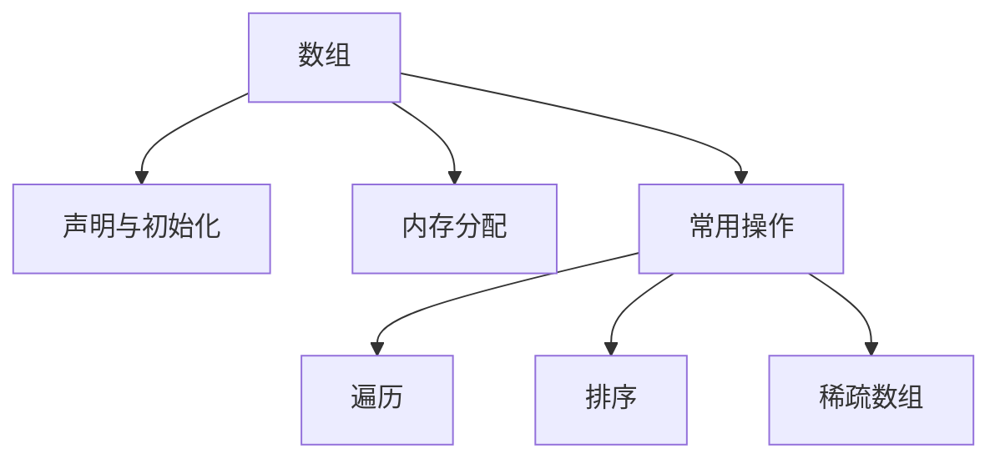

# Day 3: 数组与面向对象基础

## 📌 知识图谱


## 🧩 代码实验室

### 核心练习

#### 1. 数组基本操作
**文件路径**: [ArrayDemo.java](../../../src/main/java/com/lyh/day3/ArrayDemo.java)
```java
package com.lyh.day3;

import java.util.Arrays;

public class ArrayDemo {
    public static void main(String[] args) {
        // 声明并初始化
        int[] nums = {3, 1, 4, 1, 5};
        
        // 数组遍历
        System.out.println("原始数组: " + Arrays.toString(nums));
        
        // Arrays工具类使用
        Arrays.sort(nums);
        System.out.println("排序后: " + Arrays.toString(nums));
    }
}
```

#### 2. 冒泡排序优化版
**文件路径**: [BubbleSort.java](../../../src/main/java/com/lyh/day3/sort/BubbleSort.java)
```java
package com.lyh.day3.sort;

public class BubbleSort {
    public static void sort(int[] arr) {
        boolean swapped;
        for (int i = 0; i < arr.length-1; i++) {
            swapped = false;
            for (int j = 0; j < arr.length-1-i; j++) {
                if (arr[j] > arr[j+1]) {
                    // 交换元素
                    int temp = arr[j];
                    arr[j] = arr[j+1];
                    arr[j+1] = temp;
                    swapped = true;
                }
            }
            if (!swapped) break; // 无交换时提前终止
        }
    }
}
```

### 扩展挑战
- [ ] 实现二维数组转稀疏数组（内存优化）
- [ ] 对比不同排序算法性能

---

## ❓ 高频问题库

### Q1：数组长度不可变的本质原因？
**A**：数组在堆内存中分配连续空间，扩容需重新分配内存并复制元素

### Q2：for-each循环能否修改数组元素？
**A**：基本类型数组不能，对象数组可修改属性但不可替换对象

---

## 🧭 导航
[⬅️ Day2 方法与流程控制](../Day2.md)  
[➡️ Day4 类与对象](../Day4.md)  
[🏠 返回目录](../../README.md)
