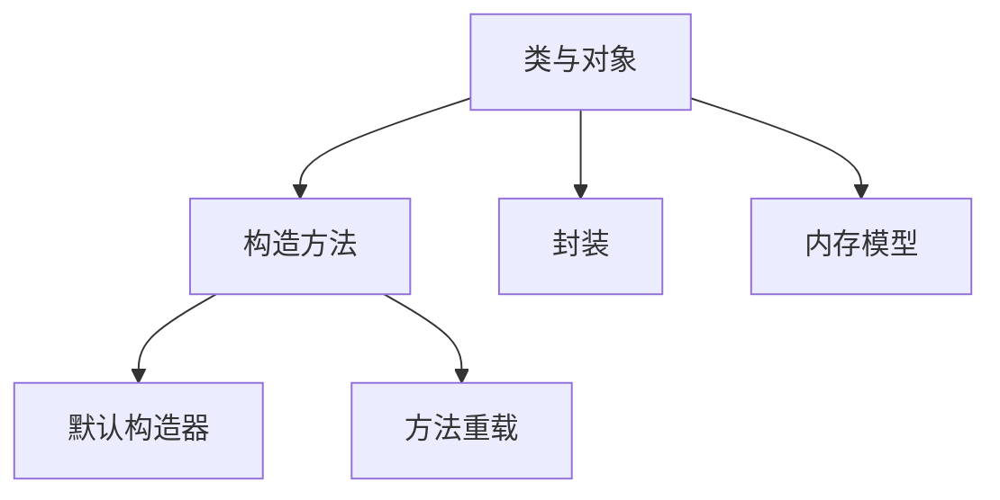

# Day 4: 类与对象基础

## 📌 知识图谱


## 🧩 代码实验室

### 核心练习

#### 1. 宠物类设计
**文件路径**: [Pet.java](../../../src/main/java/com/lyh/day4/model/Pet.java)
```java
package com.lyh.day4.model;

public class Pet {
    // 封装属性
    private String name;
    private int age;
    
    // 构造方法重载
    public Pet() {
        this("无名氏", 0);
    }
    
    public Pet(String name, int age) {
        this.name = name;
        this.age = age;
    }
    
    // Getter/Setter
    public String getName() { return name; }
    public void setName(String name) { this.name = name; }
}
```

#### 2. 对象生命周期演示
**文件路径**: [LifecycleDemo.java](../../../src/main/java/com/lyh/day4/LifecycleDemo.java)
```java
package com.lyh.day4;

import com.lyh.day4.model.Pet;

public class LifecycleDemo {
    public static void main(String[] args) {
        // 对象创建
        Pet myCat = new Pet("喵喵", 2);
        
        // 垃圾回收演示（配合JVM参数-XX:+PrintGCDetails）
        for (int i = 0; i < 100000; i++) {
            new Pet("temp", i);
        }
    }
}
```

### 扩展挑战
- [ ] 实现对象池管理
- [ ] 研究finalize()方法的实际应用

---

## ❓ 高频问题库

### Q1：构造方法能否继承？
**A**：不能，子类必须显式或隐式调用父类构造方法

### Q2：默认构造方法的生成条件？
**A**：仅当类中没有定义任何构造方法时编译器自动生成

---

## 🧭 导航
[⬅️ Day3 数组与排序](../Day3.md)  
[➡️ Day5 OOP进阶](../Day5.md)  
[🏠 返回目录](../../README.md)
