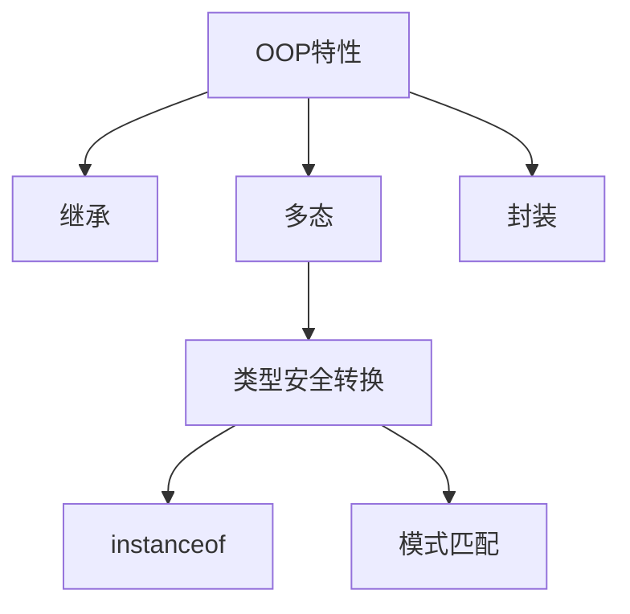

# Day 5: 面向对象进阶

## 📌 知识图谱


## 🧩 代码实验室

### 核心练习

#### 1. 类型安全转换（新增）
**文件路径**: [TypeCastDemo.java](../../src/main/java/com/lyh/day5/TypeCastDemo.java) 🔴
```java
// 新增Java16+模式匹配语法示例
if (animal instanceof Cat cat) {
    cat.catchMouse();
}
```

### 优化建议
- 在Cat/Dog类中添加更多属性验证封装性
- 尝试实现`Runnable`接口演示扩展检查

---

## ❓ 高频问题库（新增问题）

### Q3：Java16模式匹配语法优势？
```java
// 传统写法
if (animal instanceof Cat) {
    Cat cat = (Cat) animal;
    cat.catchMouse();
}

// 新模式
if (animal instanceof Cat cat) {
    cat.catchMouse(); // 自动类型转换
}
```
**A**：减少显式类型转换代码，提高可读性和安全性

---

## 🧭 导航
[⬅️ Day4 类与对象基础](Day4.md)  
[➡️ Day6 抽象类与接口](./Day6.md)  
[🏠 返回目录](../../README.md)
