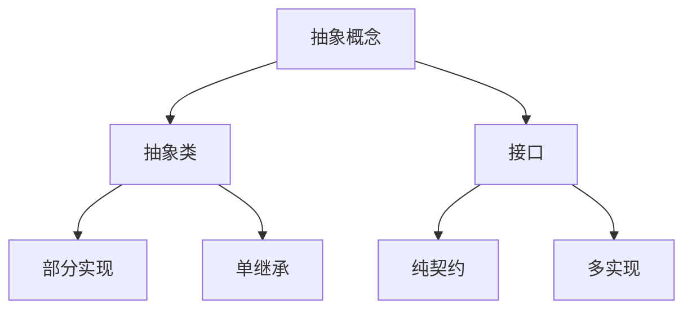

# Day6: 抽象类与接口

## 📌 知识图谱


## 🧩 核心概念

#### 抽象类 vs 接口对比表
| 特征                | 抽象类                   | 接口（JDK8+）          |
|---------------------|-------------------------|-----------------------|
| 实例化              | ❌ 不可直接实例化        | ❌ 不可直接实例化      |
| 构造方法            | ✅ 可包含                | ❌ 不可包含            |
| 字段类型            | 实例/静态/常量           | 只能是public static final|
| 方法实现            | ✅ 可包含具体方法        | ✅ 默认方法/静态方法   |
| 继承机制            | 单继承                  | 多实现                |

#### 新特性实践
```java
// 默认方法实现
public interface Flyable {
    default void fly() {
        System.out.println("使用默认飞行方式");
    }
}
```

---

## 💻 代码实验室

### 核心实现

#### 1. 抽象类定义
**文件路径**: [Animal.java](../../src/main/java/com/lyh/day6/model/Animal.java)
```java
package com.lyh.day6.model;

public abstract class Animal {
    protected String name;
    
    public Animal(String name) {
        this.name = name;
    }
    
    public abstract void move();
    
    public void breathe() {
        System.out.println(name + "正在呼吸");
    }
}
```

#### 2. 接口定义
**文件路径**: [Swimmable.java](../../src/main/java/com/lyh/day6/model/Swimmable.java)
```java
package com.lyh.day6.model;

public interface Swimmable {
    void swim();
    
    default void underwaterAction() {
        System.out.println("进行水下呼吸");
    }
}
```

#### 3. 具体实现类
**文件路径**: [Fish.java](../../src/main/java/com/lyh/day6/model/Fish.java)
```java
package com.lyh.day6.model;

public class Fish extends Animal implements Swimmable {
    private String habitat;
    
    public Fish(String name, String habitat) {
        super(name);
        this.habitat = habitat;
    }

    @Override
    public void move() {
        System.out.println(name + "摆动鱼鳍游动");
    }

    @Override
    public void swim() {
        System.out.println(name + "在" + habitat + "中快速游动");
    }
    
    public String getHabitat() {
        return habitat;
    }
}
```

**文件路径**: [Bird.java](../../src/main/java/com/lyh/day6/model/Bird.java)
```java
package com.lyh.day6.model;

public class Bird extends Animal implements Flyable {
    private double wingSpan;
    
    public Bird(String name, double wingSpan) {
        super(name);
        this.wingSpan = wingSpan;
    }

    @Override
    public void move() {
        System.out.println(name + "拍打翅膀飞行");
    }

    @Override
    public void fly() {
        System.out.printf("%s展开%.1f米翅膀飞行%n", name, wingSpan);
    }
    
    public double getWingSpan() {
        return wingSpan;
    }
}
```

---

### 主程序演示
**文件路径**: [Main.java](../../src/main/java/com/lyh/day6/Main.java)
```java
package com.lyh.day6;

import com.lyh.day6.model.*;

public class Main {
    public static void main(String[] args) {
        Animal[] animals = {
            new Fish("小蓝", "珊瑚礁"),
            new Bird("云雀", 0.8)
        };

        for (Animal animal : animals) {
            animal.breathe();
            animal.move();
            
            if (animal instanceof Swimmable swimmer) {
                swimmer.swim();
                swimmer.underwaterAction();
            }
            
            if (animal instanceof Flyable flyer) {
                flyer.fly();
            }
            
            System.out.println("----------");
        }
    }
}
```

---

### 执行结果
```
小蓝正在呼吸
小蓝摆动鱼鳍游动
小蓝在珊瑚礁中快速游动
进行水下呼吸
----------
云雀正在呼吸
云雀拍打翅膀飞行
云雀展开0.8米翅膀飞行
----------
```

---

## 🚀 扩展挑战
1. 新增`Dolphin`类实现`Swimmable`和`Intelligent`双接口
2. 尝试在接口中使用静态方法：
```java
public interface Flyable {
    static double convertToMeters(double feet) {
        return feet * 0.3048;
    }
}
```

---

## ❓ 高频问题库
### Q：抽象类可以有构造方法吗？
**A**：可以，但仅用于被子类调用，不能直接实例化

### Q：什么时候应该用默认方法？
**A**：当需要为接口添加新功能而不破坏现有实现时

---

## 🧭 导航
[⬅️ Day5 OOP进阶](../Day5)  
[➡️ Day7 异常处理](../Day7)  
[🏠 返回目录](../../README.md)
