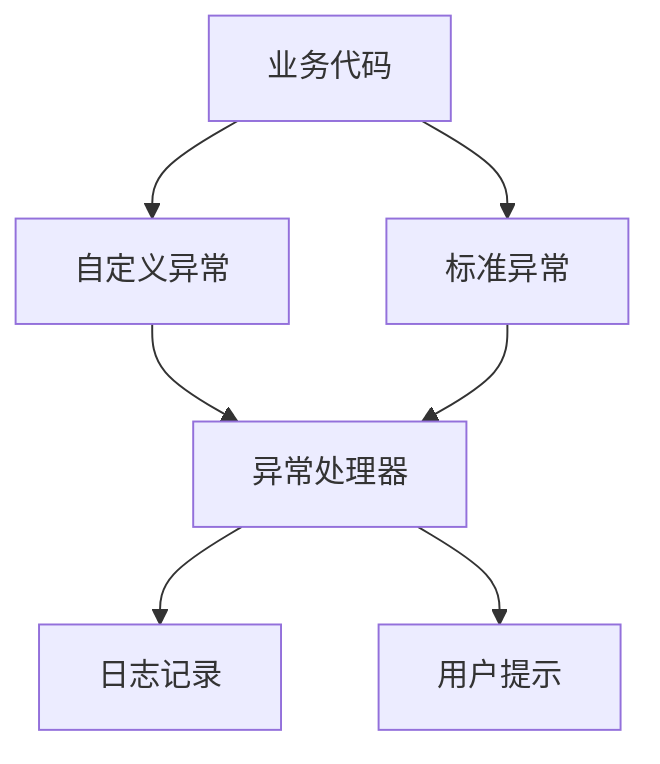

# Day7: 异常处理

## 🧩 核心概念
### 异常处理流程
- **抛出机制**：通过`throw`主动触发异常
- **捕获机制**：`try-catch`代码块处理异常
- **传播机制**：`throws`声明方法可能抛出的异常类型

### 运行时异常特点
```markdown
- ✅ 继承自`RuntimeException`
- ✅ 编译期不强制检查
- ✅ 适合表示编程错误
- ✅ 需要开发者主动预防
```

### 异常处理策略对比
| 方法            | 优点                    | 使用场景               |
|----------------|-------------------------|-----------------------|
| `try-catch`    | 就地处理异常            | 需要立即恢复的异常     |
| `throws`       | 异常责任链传递          | 当前方法无需处理时     |
| 自定义异常      | 明确业务错误类型        | 需要特定异常分类时     |

---

## 💻 代码实验室
### 场景1：多重异常捕获
**文件路径**: [ExceptionTest.java](../../src/main/java/com/lyh/day7/ExceptionTest.java)
```java
public class ExceptionTest {
    public static void main(String[] args) { /* 原样保持 */ }
    public static void test1() {}
}
```

**执行流程说明**：
1. main方法调用test1()
2. test1()尝试解析日期并调用test2()
3. test2()尝试打开文件流
4. 任何异常都通过throws向上传递
5. main方法中的多重catch进行最终处理

### 场景2：输入验证循环
**文件路径**: [ExceptionTest2.java](../../src/main/java/com/lyh/day7/ExceptionTest2.java)
```java
public class ExceptionTest2 {
    public static void main(String[] args) {}
    public static double getMoney() {}
}
```

**功能解析**：
- 采用嵌套循环结构
- 外层处理格式异常
- 内层处理数值合理性
- 通过break实现合法输入退出

---

## 📚 扩展知识
### 异常处理金字塔


### 常见抗锯齿模式
1. **防御性检查**：执行操作前验证参数
2. **空对象模式**：返回无害的默认对象
3. **状态回滚**：保证异常后的数据一致性

---

## 🧭 导航
[⬅️ Day6 抽象类与接口](./day6.md)  
[➡️ Day8 集合框架](./day8.md)  
[🏠 返回目录](../../README.md)
