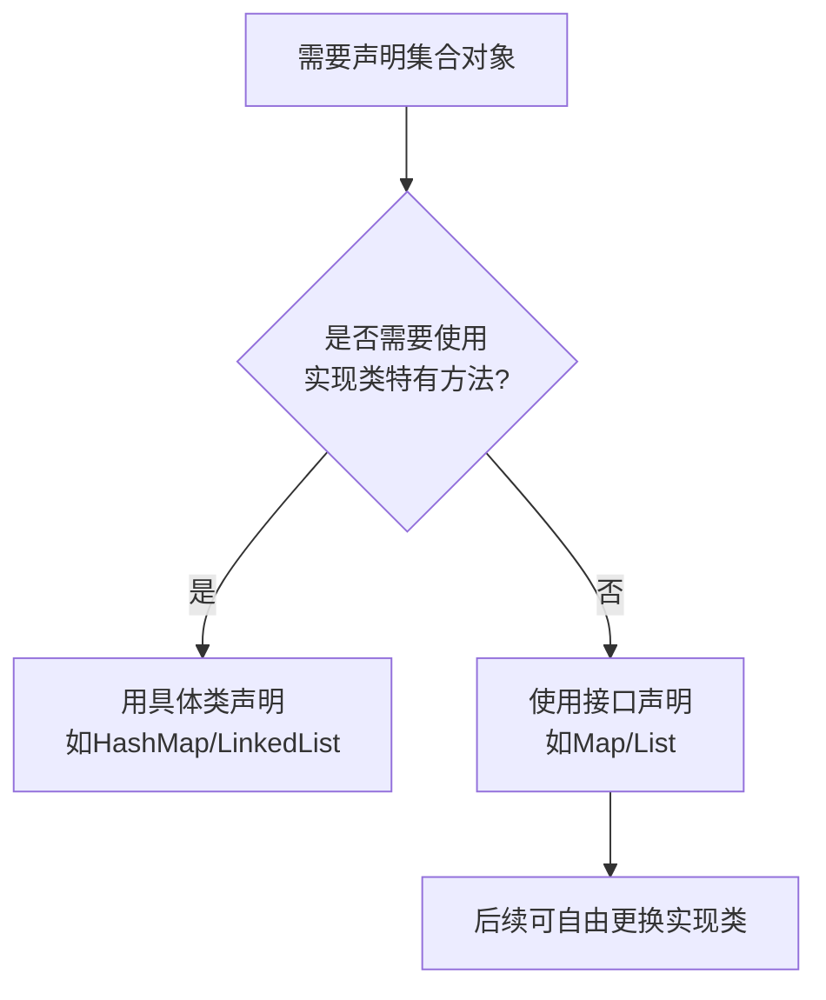

### **一、接口选择原则**
#### 1. **优先使用接口声明** → **提高代码灵活性**
```java
// 推荐写法
Map<String, Integer> map = new HashMap<>(); 

// 不推荐写法（除非必须使用HashMap特有方法）
HashMap<String, Integer> map = new HashMap<>();
```

#### 2. **何时需要使用具体类声明** → **需要调用特有方法时**
```java
LinkedHashMap<String, Integer> lruCache = new LinkedHashMap<>(16, 0.75f, true) {
    protected boolean removeEldestEntry(Map.Entry eldest) {
        return size() > 100; // 实现LRU缓存淘汰
    }
};
// 必须用LinkedHashMap类型才能覆盖removeEldestEntry方法
```

---

### **二、Java集合框架接口与实现对照表**
| 接口       | 常用实现类                 | 特点                      | 特有方法示例                |
|-----------|---------------------------|--------------------------|---------------------------|
| **List**  | ArrayList                 | 数组实现，随机访问快       | `trimToSize()`            |
|           | LinkedList                | 链表实现，插入删除快       | `addFirst()`, `removeLast()`|
| **Map**   | HashMap                   | 哈希表，无序               | `computeIfAbsent()`       |
|           | LinkedHashMap            | 保持插入顺序               | `removeEldestEntry()`     |
|           | TreeMap                  | 按键排序                  | `firstKey()`, `subMap()`  |
| **Set**   | HashSet                   | 基于HashMap实现           | 无特有方法                |
|           | TreeSet                  | 基于TreeMap实现           | `ceiling()`, `floor()`    |

---

### **三、如何查找接口与实现类的关系**
#### 方法1：**查看官方文档**
- [Java 17 Collections Framework](https://docs.oracle.com/en/java/javase/17/docs/api/java.base/java/util/doc-files/coll-overview.html)
- **文档结构示例**：
  ```text
  Interface Map
  └─ Class HashMap
  └─ Class LinkedHashMap
  └─ Class TreeMap
  ```

#### 方法2：**IDE智能提示**
在IntelliJ/Eclipse中输入：
```java
List<String> list = new // 这里按Ctrl+Space会提示所有List实现类
```

#### 方法3：**查看源码**
- 在实现类的类声明中查看`implements`语句：
  ```java
  public class HashMap<K,V> extends AbstractMap<K,V>
    implements Map<K,V>, Cloneable, Serializable {
    // ...
  }
  ```

---

### **四、关于HashMap的正确使用**
#### 1. **声明方式**
```java
// 完全正确！这是标准写法
Map<String, Integer> population = new HashMap<>();
population.put("China", 1_411_000_000);

// 如果需要用到HashMap特有方法时才需具体声明
HashMap<String, Integer> tmpMap = new HashMap<>();
tmpMap.putAll(population);
tmpMap.replaceAll((k, v) -> v * 2); // 此方法实际是Map接口的默认方法
```

#### 2. **何时必须用HashMap声明**
```java
// 需要访问包级私有方法时（非常罕见！）
HashMap<String, Integer> map = new HashMap<>();
// map.hash("secret"); // 假设hash()是HashMap的包级私有方法（仅示例）
```

---

### **五、接口选择决策流程图**


---

### **六、实战验证**
#### 任务：将`ArrayList`改为`LinkedList`
```java
// 原始代码
List<String> list = new ArrayList<>();
list.add("A");
list.add("B");

// 修改后（只需改一处）
List<String> list = new LinkedList<>(); // 其他代码无需改动！
```

**验证结果**：所有基于`List`接口的方法调用（如`add()`/`get()`）仍然有效，但底层实现已改变

---

**"编码时面向接口，实例化时选择实现"**